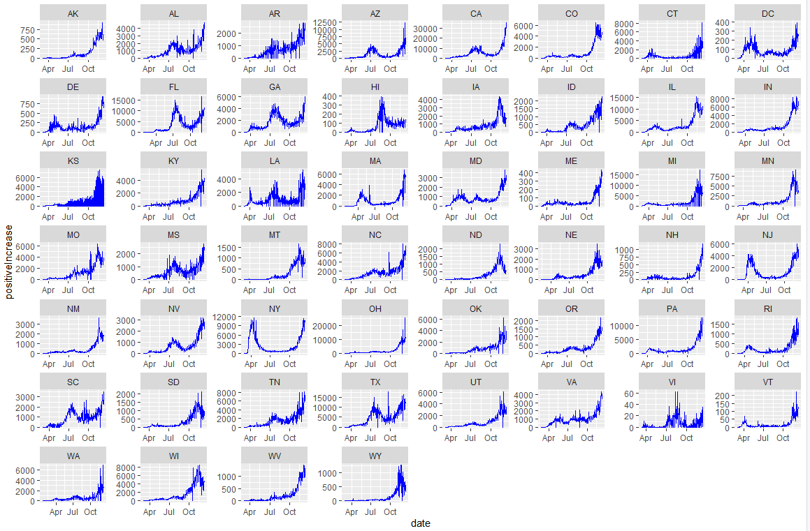

# Results

## Overall Patterns

We started by looking at how United States was doing as a whole to get an idea of the bigger picture effects of COVID-19 among all states. Below is a quick snapshot of how the states were performing. As the data suggests almost every state is exhibiting an exponential trend in daily new positive tests reaching its all time highs within the last month with a few exceptions like Hawaii, Iowa, and North Dakota. As we will discuss later in the results, this dramatic increase can be attributed to many factors such as higher testing rate, holidays, lax in public cautiousness, and increased travel. Indeed the data trends prove alarming and depict a drastic shift in COVID-19's impact on American lives. We may and have already seen changes in public policy across states. For example, New York has reverted some of the allowances of public interaction like indoor dining. California as well has issued shelter at home laws.   

```{r}
library(dplyr)
library(tidyr)
library(data.table)
library(readr)
library(ggplot2)
daily_state <- read_csv("daily_state.csv", col_types = cols(date = col_date(format = "%Y%m%d")))
```



## Patterns by Region

Now that we quantitatively established that the country as a whole has greatly been affected by COVID-19, we will focus more on the individual state-level trends. When we plot the number of confirmed and probable cases of COVID-19 in each state, we can easily see that the top states in the "high" category are California, Texas, Florida, Illinois, and New York. We quickly note that these states represent different parts of the US - West Coast, South, Southeast, Midwest, and East Coast, and COVID was widespread throughout the country.

```{r}
# Load state level data
daily_state <- read_csv("daily_state.csv", col_types = cols(date = col_date(format = "%Y%m%d")))

statedata_total <- select(daily_state, -c("checkTimeEt", "commercialScore", "dateChecked", "dateModified", "grade", "hash", "hospitalized", "negativeIncrease", "negativeRegularScore", "negativeScore", "posNeg", "positiveScore", "score", "total"))

state_positive_data <- select(statedata, c("date", "state", "positive", "positiveIncrease"))
statedata_analysis1 <- subset(state_positive_data, date == state_positive_data$date[1])

ggplot(statedata_analysis1, aes(x = positive, fct_reorder(state, positive))) +
  geom_point(color = "blue") +
  xlab("Confirmed and Probable Cases of COVID-19") +
  ylab("State") +
  theme_grey(12)
```

A few different patterns could be seen from these states. California and Texas had their COVID-19 cases mildly increase in the spring, and had their first big wave in July. They had their second big wave near the end of the year. Florida had a similar pattern as California and Texas, except they had a visible first peak in March. On the other hand, Illinois and New York had completely patterns. Illinois was able to bend the curve when it was peaking in May, and did not sharply increase until November. New York was hit the hardest in March and significantly brought down the curve in the following months. Their second wave came in November/December and it was as big as their first wave.

```{r}
# Load states with some of the highest number of reported cases
california <- daily_state[daily_state$state == 'CA',]
california <- california[order(california$date),]
florida <- daily_state[daily_state$state == 'FL',]
florida <- florida[order(florida$date),]
texas <- daily_state[daily_state$state == 'TX',]
texas <- texas[order(texas$date),]
illinois <- daily_state[daily_state$state == 'IL',]
illinois <- illinois[order(illinois$date),]
newyork <- daily_state[daily_state$state == 'NY',]
newyork <- newyork[order(newyork$date),]
newjersey <- daily_state[daily_state$state == 'NJ',]
newjersey <- newjersey[order(newjersey$date),]

# Clean data for Texas
texas$totalTestResultsIncrease[texas$totalTestResultsIncrease < 0] <- 0

# For side-by-side comparison - new dataframe
patterns <- data.frame(california$date[california$date >= '2020-03-04'], 
  california$positiveIncrease[california$date >= '2020-03-04'],
  california$totalTestResultsIncrease[california$date >= '2020-03-04'],
  texas$positiveIncrease[texas$date >= '2020-03-04'],
  texas$totalTestResultsIncrease[texas$date >= '2020-03-04'],
  florida$positiveIncrease[florida$date >= '2020-03-04'],
  florida$totalTestResultsIncrease[florida$date >= '2020-03-04'],
  illinois$positiveIncrease[illinois$date >= '2020-03-04'],
  illinois$totalTestResultsIncrease[illinois$date >= '2020-03-04'],
  newyork$positiveIncrease[newyork$date >= '2020-03-04'],
  newyork$totalTestResultsIncrease[newyork$date >= '2020-03-04'],
  newjersey$positiveIncrease[newjersey$date >= '2020-03-04'],
  newjersey$totalTestResultsIncrease[newjersey$date >= '2020-03-04']
)

names(patterns) <- c('date', 'california', 'california_test', 'texas', 'texas_test', 'florida', 'florida_test', 'illinois', 'illinois_test', 'newyork', 'newyork_test', 'newjersey', 'newjersey_test')

# Add 7 day averages for cases / tests
patterns$california_7 <- rollmean(patterns$california, k=7, fill=NA)
patterns$texas_7 <- rollmean(patterns$texas, k=7, fill=NA)
patterns$florida_7 <- rollmean(patterns$florida, k=7, fill=NA)
patterns$illinois_7 <- rollmean(patterns$illinois, k=7, fill=NA)
patterns$newyork_7 <- rollmean(patterns$newyork, k=7, fill=NA)
patterns$newjersey_7 <- rollmean(patterns$newjersey, k=7, fill=NA)

patterns$california_test_7 <- rollmean(patterns$california_test, k=7, fill=NA)
patterns$texas_test_7 <- rollmean(patterns$texas_test, k=7, fill=NA)
patterns$florida_test_7 <- rollmean(patterns$florida_test, k=7, fill=NA)
patterns$illinois_test_7 <- rollmean(patterns$illinois_test, k=7, fill=NA)
patterns$newyork_test_7 <- rollmean(patterns$newyork_test, k=7, fill=NA)
patterns$newjersey_test_7 <- rollmean(patterns$newjersey_test, k=7, fill=NA)

# Positivity Rate
patterns$california_positivity <- patterns$california_7 / patterns$california_test_7
patterns$texas_positivity <- patterns$texas_7 / patterns$texas_test_7
patterns$florida_positivity <- patterns$florida_7 / patterns$florida_test_7
patterns$illinois_positivity <- patterns$illinois_7 / patterns$illinois_test_7
patterns$newyork_positivity <- patterns$newyork_7 / patterns$newyork_test_7
patterns$newjersey_positivity <- patterns$newjersey_7 / patterns$newjersey_test_7

# Test Positivity Rate for Texas was 100% in March
patterns$texas_positivity[patterns$texas_positivity > 0.5] <- NA

# Under-reported test numbers in New Jersey until March 23
patterns$newjersey_positivity[patterns$date <= '2020-03-23'] <- NA

# Top 5 States combined
ggplot(patterns, aes(x = date)) + 
  geom_line(aes(y = california_7, colour = "California")) + 
  geom_line(aes(y = florida_7, colour = "Florida")) + 
  geom_line(aes(y = illinois_7, colour = "Illinois")) +
  geom_line(aes(y = newjersey_7, colour = "New Jersey")) +
  geom_line(aes(y = newyork_7, colour = "New York")) + 
  geom_line(aes(y = texas_7, colour = "Texas")) + 
  
  scale_colour_manual(values = c("red", "blue", "green", "brown", "black", "purple")) + 
  labs(y = "COVID Cases per Day", x = "Date", colour = "Lines") +
  theme(legend.position = c(0.1, 0.8)) +
  ggtitle("COVID in Top 5 States + NJ (7-Day Average)") +
  
  geom_vline(xintercept = as.numeric(as.Date("2020-04-12")), col = "pink", size = 0.5) +
  geom_vline(xintercept = as.numeric(as.Date("2020-05-25")), col = "pink", size = 0.5) +
  geom_vline(xintercept = as.numeric(as.Date("2020-05-26")), col = "pink", size = 0.5) +
  geom_vline(xintercept = as.numeric(as.Date("2020-07-04")), col = "pink", size = 0.5) +
  geom_vline(xintercept = as.numeric(as.Date("2020-11-03")), col = "pink", size = 0.5) +
  geom_vline(xintercept = as.numeric(as.Date("2020-11-26")), col = "pink", size = 0.5)


# Adjusted per capita
patterns$california_percapita <- patterns$california_7 / 39512223 * 100000
patterns$texas_percapita <- patterns$texas_7 / 28995881	 * 100000
patterns$florida_percapita <- patterns$florida_7/ 21477737 * 100000
patterns$illinois_percapita <- patterns$illinois_7 / 12671821 * 100000
patterns$newyork_percapita <- patterns$newyork_7 / 19453561 * 100000
patterns$newjersey_percapita <- patterns$newjersey_7 / 8882190 * 100000

# Top 5 States combined per capita
ggplot(patterns, aes(x = date)) + 
  geom_line(aes(y = california_percapita, colour = "California")) + 
  geom_line(aes(y = florida_percapita, colour = "Florida")) + 
  geom_line(aes(y = illinois_percapita, colour = "Illinois")) +
  geom_line(aes(y = newjersey_percapita, colour = "New Jersey")) +
  geom_line(aes(y = newyork_percapita, colour = "New York")) + 
  geom_line(aes(y = texas_percapita, colour = "Texas")) + 
  
  scale_colour_manual(values = c("red", "blue", "green", "brown", "black", "purple")) + 
  labs(y = "COVID Cases per Day per 100,000 People", x = "Date", colour = "Lines") +
  theme(legend.position = c(0.7, 0.8)) +
  ggtitle("COVID in Top 5 States + NJ (7-Day Average, per 100,000 people)") +
  
  geom_vline(xintercept = as.numeric(as.Date("2020-04-12")), col = "pink", size = 0.5) +
  geom_vline(xintercept = as.numeric(as.Date("2020-05-25")), col = "pink", size = 0.5) +
  geom_vline(xintercept = as.numeric(as.Date("2020-05-26")), col = "pink", size = 0.5) +
  geom_vline(xintercept = as.numeric(as.Date("2020-07-04")), col = "pink", size = 0.5) +
  geom_vline(xintercept = as.numeric(as.Date("2020-11-03")), col = "pink", size = 0.5) +
  geom_vline(xintercept = as.numeric(as.Date("2020-11-26")), col = "pink", size = 0.5)


# Top 5 States combined COVID-19 test positivity rate
ggplot(patterns, aes(x = date)) + 
  geom_line(aes(y = california_positivity, colour = "California")) + 
  geom_line(aes(y = florida_positivity, colour = "Florida")) + 
  geom_line(aes(y = illinois_positivity, colour = "Illinois")) +
  geom_line(aes(y = newjersey_positivity, colour = "New Jersey")) +
  geom_line(aes(y = newyork_positivity, colour = "New York")) + 
  geom_line(aes(y = texas_positivity, colour = "Texas")) + 
  
  scale_colour_manual(values = c("red", "blue", "green", "brown", "black", "purple")) + 
  labs(y = "COVID Positivity", x = "Date", colour = "Lines") +
  theme(legend.position = c(0.7, 0.8)) +
  ggtitle("COVID in Top 5 States + NJ (Test Positivity Rate)") +
  
  geom_vline(xintercept = as.numeric(as.Date("2020-04-12")), col = "pink", size = 0.5) +
  geom_vline(xintercept = as.numeric(as.Date("2020-05-25")), col = "pink", size = 0.5) +
  geom_vline(xintercept = as.numeric(as.Date("2020-05-26")), col = "pink", size = 0.5) +
  geom_vline(xintercept = as.numeric(as.Date("2020-07-04")), col = "pink", size = 0.5) +
  geom_vline(xintercept = as.numeric(as.Date("2020-11-03")), col = "pink", size = 0.5) +
  geom_vline(xintercept = as.numeric(as.Date("2020-11-26")), col = "pink", size = 0.5)

```

The pink vertical lines in the graph represents days with major events in the United States - Easter, Memorial Day, Start of Protests against Police Brutality, Independence Day, Election Day, and Thanksgiving Day, respectively.

From the above plots, we may think the following may have happened in the United States:

- New York (as well as New Jersey - included as another representation of the Greater NY Area) was a special case in that the spread started earlier in the year and it was able to significantly decrease the infection rate while other parts of the country suffered a huge increase in the summer
- The spike in the rest of the United States (West Coast, South, Southeast) started around Memorial Day weekend, when families were gathering for the long weekend
- The Memorial Day weekend increase was exacerbated by the protests against police brutality when people gathered onto the streets all across the country
- The number of cases decreased in the beginning of the fall (both absolute and per capita), but started to increase again in October
- All regions, including New York and New Jersey this time, started to see a huge spike in November with the Election (rallies took place) and the Thanksgiving weekend (mostly visible in California)

However, in order to validate these assumptions (that many Americans have today), we will perform a check - how was the testing done? Specifically, did the number tests stay consistent? The positivity rate seemed to stay below 0.20 for all areas. See the plots below:

## Correlation with COVID-19 Test Numbers?

```{r}
library(zoo)
california$positiveIncrease_7 <- rollmean(california$positiveIncrease, k=7, fill=NA)
california$totalTestResultsIncrease_7 <- rollmean(california$totalTestResultsIncrease, k=7, fill=NA)
florida$positiveIncrease_7 <- rollmean(florida$positiveIncrease, k=7, fill=NA)
florida$totalTestResultsIncrease_7 <- rollmean(florida$totalTestResultsIncrease, k=7, fill=NA)
texas$positiveIncrease_7 <- rollmean(texas$positiveIncrease, k=7, fill=NA)
texas$totalTestResultsIncrease_7 <- rollmean(texas$totalTestResultsIncrease, k=7, fill=NA)
illinois$positiveIncrease_7 <- rollmean(illinois$positiveIncrease, k=7, fill=NA)
illinois$totalTestResultsIncrease_7 <- rollmean(illinois$totalTestResultsIncrease, k=7, fill=NA)
newyork$positiveIncrease_7 <- rollmean(newyork$positiveIncrease, k=7, fill=NA)
newyork$totalTestResultsIncrease_7 <- rollmean(newyork$totalTestResultsIncrease, k=7, fill=NA)
newjersey$positiveIncrease_7 <- rollmean(newjersey$positiveIncrease, k=7, fill=NA)
newjersey$totalTestResultsIncrease_7 <- rollmean(newjersey$totalTestResultsIncrease, k=7, fill=NA)

# California
ggplot(california, aes(x = date)) + 
  geom_line(aes(y = totalTestResultsIncrease_7, colour = "Daily Total Tests")) + 
    geom_line(aes(y = positiveIncrease_7*10, colour = "Daily Positive Cases")) +

      scale_y_continuous(sec.axis = sec_axis(~.*0.1, name = "Daily Positive Cases")) +
      scale_colour_manual(values = c("blue", "red")) + 
      labs(y = "Daily Total Tests", x = "Date", colour = "Lines") +
      theme(legend.position = c(0.2, 0.8)) +
      ggtitle("COVID in California (7-Day Average)")

# Florida
ggplot(florida, aes(x = date)) + 
  geom_line(aes(y = totalTestResultsIncrease_7, colour = "Daily Total Tests")) + 
  geom_line(aes(y = positiveIncrease_7*10, colour = "Daily Positive Cases")) +
  
  scale_y_continuous(sec.axis = sec_axis(~.*0.1, name = "Daily Positive Cases")) +
  scale_colour_manual(values = c("blue", "red")) + 
  labs(y = "Daily Total Tests", x = "Date", colour = "Lines") +
  theme(legend.position = c(0.2, 0.8)) +
  ggtitle("COVID in Florida (7-Day Average)")

# Texas
ggplot(texas, aes(x = date)) + 
  geom_line(aes(y = totalTestResultsIncrease_7, colour = "Daily Total Tests")) + 
  geom_line(aes(y = positiveIncrease_7*10, colour = "Daily Positive Cases")) +
  
  scale_y_continuous(sec.axis = sec_axis(~.*0.1, name = "Daily Positive Cases")) +
  scale_colour_manual(values = c("blue", "red")) + 
  labs(y = "Daily Total Tests", x = "Date", colour = "Lines") +
  theme(legend.position = c(0.2, 0.8)) +
  ggtitle("COVID in Texas (7-Day Average)")

# Illinois
ggplot(illinois, aes(x = date)) + 
  geom_line(aes(y = totalTestResultsIncrease_7, colour = "Daily Total Tests")) + 
  geom_line(aes(y = positiveIncrease_7*10, colour = "Daily Positive Cases")) +
  
  scale_y_continuous(sec.axis = sec_axis(~.*0.1, name = "Daily Positive Cases")) +
  scale_colour_manual(values = c("blue", "red")) + 
  labs(y = "Daily Total Tests", x = "Date", colour = "Lines") +
  theme(legend.position = c(0.2, 0.8)) +
  ggtitle("COVID in Illinois (7-Day Average)")

# New York
ggplot(newyork, aes(x = date)) + 
  geom_line(aes(y = totalTestResultsIncrease_7, colour = "Daily Total Tests")) + 
  geom_line(aes(y = positiveIncrease_7*10, colour = "Daily Positive Cases")) +
  
  scale_y_continuous(sec.axis = sec_axis(~.*0.1, name = "Daily Positive Cases")) +
  scale_colour_manual(values = c("blue", "red")) + 
  labs(y = "Daily Total Tests", x = "Date", colour = "Lines") +
  theme(legend.position = c(0.2, 0.8)) +
  ggtitle("COVID in New York (7-Day Average)")

# New Jersey
ggplot(newjersey, aes(x = date)) + 
  geom_line(aes(y = totalTestResultsIncrease_7, colour = "Daily Total Tests")) + 
  geom_line(aes(y = positiveIncrease_7*10, colour = "Daily Positive Cases")) +
  
  scale_y_continuous(sec.axis = sec_axis(~.*0.1, name = "Daily Positive Cases")) +
  scale_colour_manual(values = c("blue", "red")) + 
  labs(y = "Daily Total Tests", x = "Date", colour = "Lines") +
  theme(legend.position = c(0.2, 0.8)) +
  ggtitle("COVID in New Jersey (7-Day Average)")

```

With the exception of New York and New Jersey, we can see that number of cases mirror the number of tests in each state. Florida is a good example of the decrease in tests. In July, the number of tests started to decline from 90,000 to 50,000 by fall. When the number of tests decreased by half, the number of COVID-19 cases decreased by a quarter from 12,000 to 3,000. When Florida started to increase the tests back to above 100,000 per day, the number of cases spiked back up to 9,000.

We acknowledge the correlation between the number of tests and the number of positive cases in many parts of the country, and note that the "decrease" in cases between the summer and the fall may be due to reduced testing. The pattern for the entire country may be similar to that of Illinois where the number of positive cases consistently increased from June/July when many states started to loosen up the social distancing rules, and exploded starting in October, which could have multiple reasons including the whether, election, and simply people growing tired after months of social distancing.

